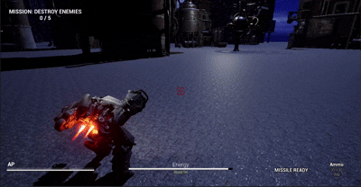
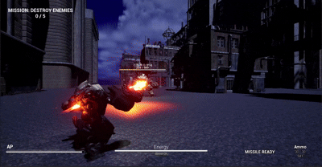

# 🤖 Project: FRONTLINE




> Unreal Engine 5 기반 3D 메카 PVE 액션 프로젝트입니다.  
> 본 저장소는 팀 레포 소개가 아닌, **개인 기여 중심 개발 포트폴리오 문서**를 목적으로 작성되었습니다.

---

## 📖 프로젝트 개요 (Overview)

- **프로젝트 성격:** 개인 포트폴리오용 정리 저장소
- **저장소 공개 여부:** Public
- **개발 기간:** 2025.10.30 ~ 2025.12.15 (약 2개월)
- **개발 인원:** 1인 개발
- **사용 엔진:** Unreal Engine 5.3
- **주요 기술:** C++, Blueprint, GAS, Enhanced Input, UMG, Behavior Tree
- **개발 환경:** Visual Studio
- **대상 플랫폼:** PC (Windows)
- **대상 플랫폼 버전:** Windows 10 / Windows 11
- **지원 포지션 관점:** 게임플레이 프로그래머

---

## 🎯 핵심 전투 목표

- 정적인 교환전이 아닌, 기동과 판단을 요구하는 전투 경험 설계
- 플레이어가 즉시 체감 가능한 손맛 중심 전투 피드백 구현
- 보스 패턴을 통해 대응 방식을 바꾸게 만드는 전투 흐름 구성

---

## 🎮 게임 플레이 플로우

- 게임 시작 후 `MissionManager`가 미션 상태를 중앙에서 관리
- 일반 전투 구간에서 플레이어 GAS와 Enemy AI 전투 루프 동작
- 적 처치 이벤트(`NotifyEnemyKilled`) 기반 킬 카운트 누적
- 목표 수 달성 시 보스 페이즈 전환(`StartBossPhase`)
- 보스 처치 시 슬로우모션 연출 후 클리어 UI 출력

---

## 🛠️ 핵심 기여 요약 (My Contributions)

### 1) 플레이어 전투 코어 구조 설계
`ACharacter` 기반 베이스 클래스에서 전투, 입력, 카메라, GAS를 통합했습니다.

- `AbilitySystemComponent`와 `MechaAttributeSet` 기반 전투 상태 관리
- Enhanced Input 이벤트를 GAS 어빌리티 실행 파이프라인으로 연결
- 락온, 시점 보간, 피격 방향 판정을 전투 흐름에 결합

### 2) GAS 기반 전투 시스템 모듈화
어빌리티를 역할 단위로 분리하고, 태그 기반으로 상태 제어를 통합했습니다.

- `GA_AssaultBoost`, `GA_Hover`, `GA_Attack`, `GA_GunFire`, `GA_Reload` 구현
- `State.Overheated`, `Block.Fire` 등 `GameplayTag` 기반 제약 적용
- `GE_InitAttributes_*`로 초기 스탯을 코드 하드코딩 대신 데이터 분리

### 3) Tick-less Event-Driven UI 최적화
매 프레임 UI 갱신을 제거하고, 값 변경 시점에만 반응하도록 구성했습니다.

- `GetGameplayAttributeValueChangeDelegate` 기반 HUD 갱신
- `MissionManager`를 `bCanEverTick = false` 구조로 설계
- 보스 체력바, 경고 UI, 클리어 UI를 이벤트로 분리 연동
- 위젯 참조 캐싱 및 생명주기 제어로 불필요한 메모리/연산 방지

### 4) Enemy/Boss 전투 패턴 구조화
일반 적 구조를 재사용하면서 보스 전용 패턴만 선택 확장했습니다.

- `AEnemyMecha` 기반 공통 전투 시스템 재사용
- 보스 전용 패턴 `GA_BossMissileRain` 추가
- BT/Blackboard 연계로 상태 기반 의사결정 구성
- Boss 전투 중 UI 및 상태 락을 연동해 전투 흐름 안정화

### 5) 물리/벡터 기반 전투 감각 개선
단순 연출이 아니라 수학/물리 기반으로 조작감을 개선했습니다.

- 락온 후보 탐색 시 Dot Product 기반 시야각 필터링
- `FMath::RInterpTo`로 카메라 회전을 부드럽게 보정
- 어설트부스트 시 `MOVE_Flying` 전환과 중력/마찰 간섭 차단
- 미사일은 `ProjectileMovementComponent` Homing 기능으로 Tick-less 추적

---

## 🧩 코드 스타일 및 아키텍처 규칙

- Unreal Engine 표준 네이밍 준수
- `UPROPERTY`, `UFUNCTION` 카테고리 명시
- `bool` 접두사 `b` 사용
- 전투 규칙과 상태는 C++ 중심, 연출과 튜닝은 Blueprint로 분리
- 이벤트 기반 업데이트를 우선 적용해 Tick 의존 최소화

---

## 📦 에셋 관리 방식 (Asset Management)

- C++ 클래스는 `Source/Project_Mecha`에서 기능 단위로 관리
- UMG, BP, 이펙트 에셋은 `Content` 하위 역할별 폴더로 분리
- GAS 관련 에셋은 네이밍 규칙(`GA_`, `GE_`)으로 일관화

---

## 🌟 주요 기능 상세 (Features)

### 1) 플레이어 전투 코어 로직
입력 처리, 락온, 피격 방향 판정, 전투 흐름 제어

- 핵심 구현: `Enhanced Input` 이벤트 처리, 락온 타겟 탐색, 카메라 보간, 피격 방향 판정
- 관련 코드:
  - [`MechaCharacterBase.h`](./Source/Project_Mecha/MechaCharacterBase.h)
  - [`MechaCharacterBase.cpp`](./Source/Project_Mecha/MechaCharacterBase.cpp)

### 2) GAS 스탯 시스템
체력, 에너지, 탄약 Attribute 정의 및 보정

- 핵심 구현: Attribute Clamp, 초기 스탯 적용, 상태 연동
- 관련 코드:
  - [`MechaAttributeSet.h`](./Source/Project_Mecha/MechaAttributeSet.h)
  - [`MechaAttributeSet.cpp`](./Source/Project_Mecha/MechaAttributeSet.cpp)

### 3) 부스트 능력 구현
물리 간섭 제거형 기동 처리 및 카메라 반응

- 핵심 구현: `MOVE_Flying` 전환, `StopMovementImmediately` 적용, 종료 시 이동 모드 복귀
- 관련 코드:
  - [`GA_AssaultBoost.h`](./Source/Project_Mecha/GA_AssaultBoost.h)
  - [`GA_AssaultBoost.cpp`](./Source/Project_Mecha/GA_AssaultBoost.cpp)

### 4) 사격 및 발사 조건 처리
태그 기반 발사 제약 및 전투 리소스 연동

- 핵심 구현: 재장전/차단 상태 태그 검사, 발사 조건 제어
- 관련 코드:
  - [`GA_GunFire.h`](./Source/Project_Mecha/GA_GunFire.h)
  - [`GA_GunFire.cpp`](./Source/Project_Mecha/GA_GunFire.cpp)

### 5) 유도 미사일 처리
Homing 타겟 지정 및 공간 쿼리 기반 타겟 필터링

- 핵심 구현: `ProjectileMovementComponent` Homing 설정, `OverlapMultiByChannel` 기반 탐색
- 관련 코드:
  - [`GA_MissleFire.h`](./Source/Project_Mecha/GA_MissleFire.h)
  - [`GA_MissleFire.cpp`](./Source/Project_Mecha/GA_MissleFire.cpp)

### 6) 적 및 보스 전투 로직
AI 전투 행동, 보스 상태 전환, 피격 및 사망 처리

- 핵심 구현: Enemy 전투 상태 처리, Boss 패턴 안정화, 슈퍼아머 태그 연동
- 관련 코드:
  - [`EnemyMecha.h`](./Source/Project_Mecha/EnemyMecha.h)
  - [`EnemyMecha.cpp`](./Source/Project_Mecha/EnemyMecha.cpp)
  - [`GA_BossMissileRain.cpp`](./Source/Project_Mecha/GA_BossMissileRain.cpp)

### 7) 미션 및 보스 페이즈 관리
Tick-less 미션 진행, 킬 카운트, 보스 페이즈 전환

- 핵심 구현: `NotifyEnemyKilled`, `StartBossPhase`, `NotifyBossDefeated`
- 관련 코드:
  - [`MissionManager.h`](./Source/Project_Mecha/MissionManager.h)
  - [`MissionManager.cpp`](./Source/Project_Mecha/MissionManager.cpp)

### 8) 이벤트 기반 HUD 업데이트
Delegate 기반 실시간 UI 반영

- 핵심 구현: Attribute 변경 Delegate 바인딩, 플레이어/적 체력 UI 갱신
- 관련 코드:
  - [`WBP_MechaHUD.h`](./Source/Project_Mecha/WBP_MechaHUD.h)
  - [`WBP_MechaHUD.cpp`](./Source/Project_Mecha/WBP_MechaHUD.cpp)
  - [`WBP_EnemyHealth.h`](./Source/Project_Mecha/WBP_EnemyHealth.h)
  - [`WBP_EnemyHealth.cpp`](./Source/Project_Mecha/WBP_EnemyHealth.cpp)
  - [`BossHealthWidget.h`](./Source/Project_Mecha/BossHealthWidget.h)
  - [`BossHealthWidget.cpp`](./Source/Project_Mecha/BossHealthWidget.cpp)
---

## 🧪 트러블슈팅 (Troubleshooting)

### 1) 시야 밖 적이 락온되는 문제
- **원인:** 거리 기반 근접 탐색만 사용해 방향 정보 누락
- **해결:** 전방 벡터와 대상 벡터 Dot Product 계산 후 FOV 각도 필터 적용
- **결과:** 정면 우선 락온으로 조작 신뢰도 개선

### 2) 어설트부스트 궤적이 포물선처럼 깨지는 문제
- **원인:** Falling 상태에서 중력/마찰이 전진 가속에 간섭
- **해결:** 부스트 중 `MOVE_Flying` 전환, `StopMovementImmediately`로 관성 제거
- **결과:** 직선 돌진 궤적 확보, 체감 속도 개선

### 3) 보스 광역 패턴이 피격 리액션으로 취소되는 문제
- **원인:** 패턴 시전 중 HitReact 몽타주가 강제 재생
- **해결:** 패턴 시 `State.SuperArmor` 태그 부여 후 피격 함수에서 태그 검사
- **결과:** 보스 패턴 안정성 확보 및 AI 상태 이탈 방지

### 4) 피격 몽타주 섹션 연동 오류와 과호출
- **원인:** 섹션 링크 설정 누락과 연속 호출 차단 로직 부재
- **해결:** 몽타주 섹션 링크 정리와 `bCanPlayHitReact` 타이머 쿨다운 추가
- **결과:** 피격 연출 품질 개선, 과도한 애니메이션 재생 방지

---

## 🙋 담당 역할 요약 (Role Summary)

- 전투 코어 시스템 설계 및 구현
- GAS 능력 구조 설계 및 상태 규칙 정립
- Event-Driven UI 연동 및 갱신 최적화
- 적 AI 및 보스 패턴 구현
- 미션 흐름 및 게임 상태 관리
- 전투 관련 트러블슈팅 및 안정화

---


## 📂 폴더 구조 (Directory Structure)

```text
Source/Project_Mecha/
├─ MechaCharacterBase.*      # 플레이어 코어 전투 로직
├─ MechaAttributeSet.*       # GAS 스탯 정의 및 제어
├─ EnemyMecha.*              # 적/보스 전투 로직
├─ MissionManager.*          # 미션 진행 및 보스 페이즈 관리
├─ GA_*.*                    # Gameplay Ability 구현
├─ WBP_*.*                   # HUD/전투 UI 위젯 클래스
└─ ...
Content/
Config/
